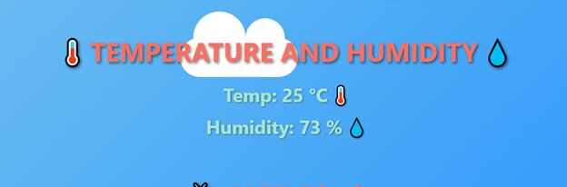

# ESP32 Webserver Project: RGB Control, Sensor Data, and Weather Station  

## **Project Overview**  
This project demonstrates the implementation of a webserver using an ESP32 microcontroller. The webserver operates in both Access Point (AP) and Station (STA) modes, allowing users to:  
1. Control an RGB LED using a web interface.  
2. Display real-time temperature and humidity data from a DHT11 sensor.  
3. Send custom messages to an OLED display.  
4. View a weather station interface with dynamic alerts based on temperature and humidity.  

The project is divided into two tasks:  
- **Task 1:** Basic webserver for RGB control, sensor data, and OLED display.  
- **Task 2:** Advanced weather station with alerts and dynamic UI.  

---

## **Features**  
### **Task 1: Basic Webserver**  
- **RGB Control:**  
  - Turn the RGB LED red, green, or blue using buttons.  
  - Input custom RGB values to set the LED color.  
- **Sensor Data:**  
  - Display real-time temperature and humidity from the DHT11 sensor.  
- **OLED Display:**  
  - Send custom messages to the OLED display via the web interface.  
- **Styling:**  
  - Dynamic background changes based on temperature.  

### **Task 2: Weather Station**  
- **Dynamic Alerts:**  
  - High Temperature: "🔥 Hot Temperature!"  
  - Normal Temperature: "🌤️ Normal Temperature!"  
  - Low Temperature: "❄️ Cold Temperature!"  
  - High Humidity: "High Humidity!"  
  - Low Humidity: "Dry!"  
- **Dynamic Backgrounds:**  
  - Day, Hot, and Night themes based on temperature.  
- **OLED Updates:**  
  - Display temperature, humidity, and alerts on the OLED.  

---

## **Hardware Requirements**  
- ESP32 microcontroller  
- DHT11 temperature and humidity sensor  
- NeoPixel RGB LED  
- SSD1306 OLED display  
- Breadboard and connecting wires  

---

## **Software Requirements**  
- Thonny IDE (or any MicroPython-compatible IDE)  
- MicroPython firmware for ESP32  
- Libraries:  
  - `network` (for WiFi connectivity)  
  - `machine` (for GPIO and I2C control)  
  - `neopixel` (for RGB LED control)  
  - `dht` (for DHT11 sensor)  
  - `ssd1306` (for OLED display)  

---

## **Setup Instructions**  
1. **Upload Code:**  
   - Upload the provided MicroPython code (`task1.py` and `task2.py`) to the ESP32 using Thonny IDE.  
2. **Connect Hardware:**  
   - Connect the DHT11 sensor, RGB LED, and OLED display to the ESP32 as per the pin configuration in the code.  
3. **Configure WiFi:**  
   - Update the `ssid_st` and `password_st` variables in the code with your WiFi credentials.  
4. **Run the Code:**  
   - Execute the code on the ESP32. The device will connect to WiFi and create an access point.  
5. **Access the Web Interface:**  
   - Open a browser and navigate to the ESP32's IP address (displayed in the serial monitor).  

---

## **Code Structure**  
### **Task 1 Code (`task1.py`)**  
- **WiFi Setup:** Connects to WiFi in STA mode and creates an AP.  
- **DHT11 Sensor:** Reads temperature and humidity data.  
- **NeoPixel Control:** Controls the RGB LED based on user input.  
- **OLED Display:** Updates the OLED with custom messages.  
- **Web Server:** Handles HTTP requests and serves the web page.  

### **Task 2 Code (`task2.py`)**  
- **Dynamic Alerts:** Provides alerts based on temperature and humidity.  
- **Dynamic Backgrounds:** Changes the web page background based on temperature.  
- **OLED Updates:** Displays sensor data and alerts on the OLED.  

---

## **Contributions**  
- **HAssaan:**  
  - Created the basic AP-STA mode template.  
  - Implemented RGB control with user input.  
  - Assisted with HTML and CSS design.  
- **Kanza:**  
  - Fixed OLED display issues.  
  - Implemented custom message display on the OLED.  
  - Contributed to the weather station design.  
- **Maryam:**  
  - Integrated and fixed DHT11 sensor functionality.  
  - Implemented temperature and humidity alerts.  
  - Assisted with HTML and CSS design.  

---

## **Screenshots**  

### **Task 1**
**Web Interface**

**RGB control buttons and input fields**

**Temperature and humidity display**

**OLED message input field**

---
### **Task 2**

**Physical OLED**

 

